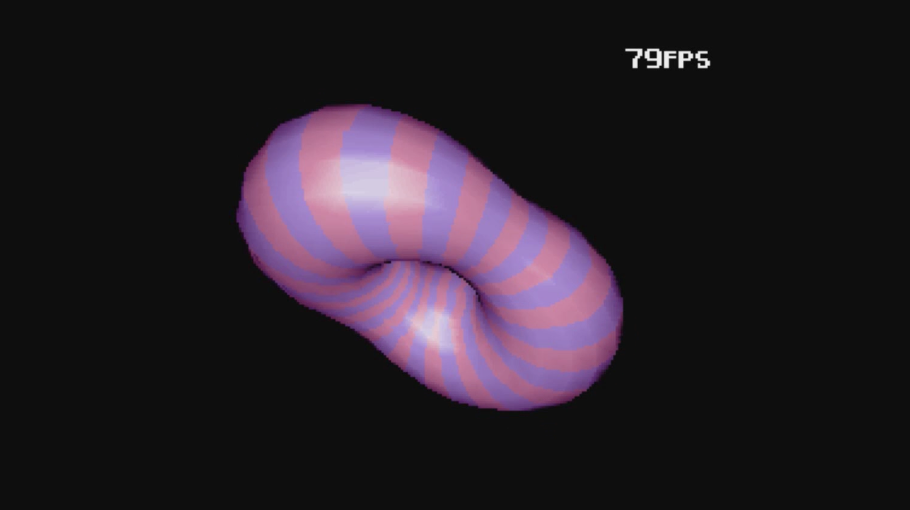

# Amiga-3D
Oldschool demoscene 3D-routines for Amiga computers

# What is Amiga-3D and what purpose it is for
Amiga-3D is a collection of various routines that together can be used to build working simple 3D-engine with rotating and software shading. With routine you can enjoy realtime calculated 3D-objects on your retro Amiga system.
Routines are written in Motorola 68020+ assembly that can build using AsmOne/AsmPro or VASM compilers.

# Required software and hardware
Building can be done either in Amiga-environment or cross-compiled in Windows, Linux or Mac-environment using VASM assembler (vasmm68k_mot).
Execution requires an Amiga computer with AGA-chipset (Amiga 1200 or 4000) with fast as possible CPU (68060 preferred) and 68881/2 FPU and some fast RAM also. If you do not have an accelerated AMIGA you may try an SoftFPU emulation like softieee (https://aminet.net/package/util/libs/SoftIEEE). Due to the high need of core CPU/FPU power a PiStorm32, Apollo Vampire, Pimiga or emulation like WinUAE/FS-UAE emulator are highly recommended.

# Building the program
Easiest to build the program is using AsmPro/AsmOne compiler where you need just to load the **main.s** source-code in to the editor by selecting folder with command **v foldername** and reading the actual source-code with command **r main.s**. Then compiling the source with command **a**. After successful compiling you can optionally create an executable file with command **wo filename**. You can either run the program from an editor with command **j**. Or running the executable from CLI.
Alternately you can build the program using your cross-compiling environment with following command: **vasmm68k_mot -m68040 -Devpac -fhunkexe main.s -o main.exe** and after successful compilng copy the executable file to your Amiga and run it from CLI.
